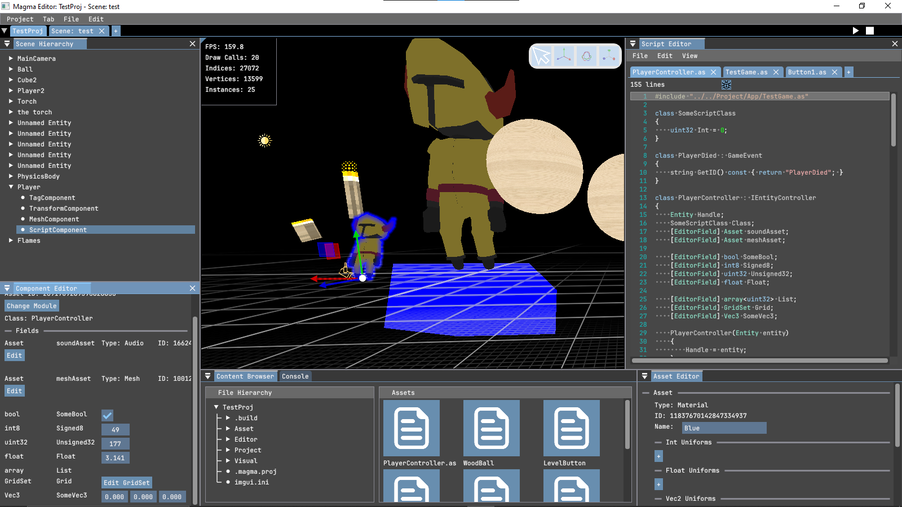
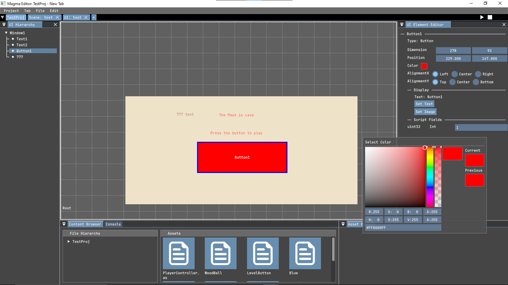

[](https://github.com/Jernesstar/VolcanicEngine/releases)
[](https://github.com/Jernesstar/VolcanicEngine/blob/main/LICENSE)
[](https://jernesstar.github.io/VolcanicEngine/)
<!-- [](https://discord.gg/trackmania) -->

# Vision
A simple, modular and capable game engine for programmers of all levels of expertise

# Features & Architecture
- ***Fast*** & **Pure** Entity Component System using [**flecs**](https://github.com/SanderMertens/flecs.git)
- Physics powered by [**NVIDIA PhysX**](https://github.com/NVIDIA-Omniverse/PhysX.git)
- Intuitive UI system rendered with [**ImGui**](https://github.com/ocornut/imgui.git)
- Scripting simplified using [**Angelscript**](https://www.angelcode.com/angelscript/)
- **Modern** OpenGL utilizing **advanced** optimization techniques

and much more!
# Project Structure

## [VolcaniCore : The Core](https://github.com/Jernesstar/VolcanicEngine/wiki/VolcaniCore)
Provides the functions and abstractions used throughtout the rest of the project.  
Defines the rendering architecture and abstractions.

## Magma
### [The Library](https://github.com/Jernesstar/VolcanicEngine/wiki/Magma)
Defines the Scene, and UIPage objects, as well as functions and classes for:
- Audio
- Scripting
- Physics

### [The Editor](https://github.com/Jernesstar/VolcanicEngine/wiki/Editor)
Where your creativity gets to flow. The intuitive visual tools needed to bring **your** game to life.  
Some features are:
- Hot reloading of all assets, including shaders and scripts
- Built-in script editor with:
    - Linting
    - On-hover descriptions for functions and classes
    - Line-by-line debugger with variable inspector
- Fast in-editor testing of scenes and UI
### The SceneTab

### The UITab


## Lava
### [The Library](https://github.com/Jernesstar/VolcanicEngine/wiki/Lava)
Defines the App class, the bridge between your **angelscript** app and the VolcanicEngine's **C++** application.  
Also defines the numerous classes, functions and bindings for the scripting language
### [The Runtime](https://github.com/Jernesstar/VolcanicEngine/wiki/Runtime)
The application used to run the game as a standalone.

# Download instructions
For **Windows**: Go to [releases](https://github.com/Jernesstar/VolcanicEngine/releases). Download the installer, run it and follow the instructions.  
For **Linux**: Go to [releases](https://github.com/Jernesstar/VolcanicEngine/releases).  
Download the .deb file, navigate to the directory where the .deb file is located and run
```bash
sudo dpkg -i ./VolcanicEngine.deb
```
# Build instructions
Clone the repo and pull all submodules
```bash
git clone https://github.com/Jernesstar/VolcanicEngine.git
git submodule update --init
```
The build system uses **premake**. On Linux, run
```bash
scripts/Unix/premake.sh
```
and for Windows, run
```cmd
scripts/Windows/premake.bat
```
Run the following instead for MSVC:
```cmd
.\vendor\premake\bin\Windows\premake5.exe vs2022
```
This will generate the Makefiles/solution and project files for the project. After this step is complete, run
```bash
scripts/Unix/build.sh
```
and for Windows, run
```cmd
scripts/Windows/build.bat
```
For MSVC, simply build the project.
