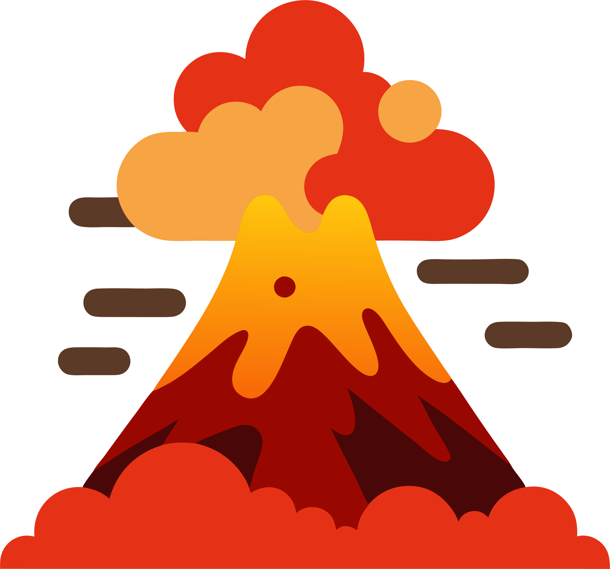
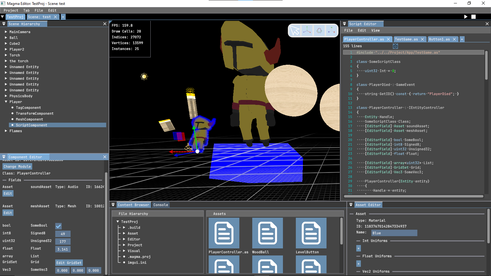

<!--  -->

# Vision
A simple, modular and capable game engine for programmers of all levels of expertise

# Features & Architecture
- ***Fast*** & **Pure** Entity Component System using [**flecs**](https://github.com/SanderMertens/flecs.git)
- Physics powered by [**NVIDIA PhysX**](https://github.com/NVIDIA-Omniverse/PhysX.git)
- Intuitive UI system rendered with [**ImGui**](https://github.com/ocornut/imgui.git)
- Scripting simplified using [**Angelscript**](https://www.angelcode.com/angelscript/)
- **Modern** OpenGL utilizing **advanced** optimization techniques

and much more!
# Project Structure

## [VolcaniCore : The Core](https://github.com/Jernesstar/VolcanicEngine/wiki/VolcaniCore)
Provides the functions and abstractions used throughtout the rest of the project.  
Defines the rendering architecture and abstractions.

## Magma
### [The Library](https://github.com/Jernesstar/VolcanicEngine/wiki/Magma)
Defines the Scene, and UIPage objects, as well as functions and classes for:
- Audio
- Scripting
- Physics

### [The Editor](https://github.com/Jernesstar/VolcanicEngine/wiki/Editor)
Where your creativity gets to flow. The intuitive visual tools needed to bring **your** game to life.  
Some features are:
- Hot reloading of all assets, including shaders and scripts
- Built-in script editor with linting and line-by-line debugger
- Fast in-editor testing of scenes and UI
### The SceneTab and its panels

## Lava
### [The Library](https://github.com/Jernesstar/VolcanicEngine/wiki/Lava)
Defines the App class, the bridge between your **angelscript** app and the VolcanicEngine's **C++** application.  
Also defines the numerous classes, functions and bindings for the scripting language
### [The Runtime](https://github.com/Jernesstar/VolcanicEngine/wiki/Runtime)
The application used to run the game as a standalone.

## Ash : The Ray Tracing Engine (coming soon!)
Defines functions for rendering boxes, and spheres, and meshes using accurate, real-time and state-of-the-art ray tracing techniques.

# FAQ
### Is there really a need for yet another game engine?
Let's be honest, game engines kind of **suck**.  
Think back to the last time you opened up a project in your engine of choice,  
only for startup to take 3 minutes. And once you get past that,
testing the game takes forever.  
Think back further to the **first time** you ever opened up the engine's editor,  
and were left completely **confused** and overwhelmed as to where to start, quickly falling into **tutorial hell**.

This engine is different.
<!-- TODO(Add): Testimonials -->
### Angelscript? What's that? Why use a language no one's heard of before?
[**Angelscript**](https://www.angelcode.com/angelscript/) is a scripting language syntactically similar to **C#**, **C++**, **Java** and **Python**.  
It seeks to combine some of the most convenient features from these languages.  
"*Why not just use the aforementioned languages directly?*", you may ask. Here are a few reasons.  

**C#** is namely used by Unity. However, it is not known for being performant, both at compile and run time.  
Unreal uses **C++** and **Blueprints**, which provide a speed boost, but can be quite complex to use (it's C++).  
**Python** is syntactically simpler, but being an interpreted language, it is again, slow.  
**Lua** is also a popular choice, but unless you're a Roblox programmer, who wants to write Lua code all day?  

**Angelscript** solves all these problems. Its syntax provides a **familiar feel** to those currently using established engines,  
a syntax **easy to learn** for anyone picking up game dev for the **first time**, all while approaching **C++ performance**.

As for the question of novelty, **Angelscript** has already made its way into industry-level code.  
It is actively developed by ***Hazelight*** Studios for use in [UnrealEngine-Angelscript](https://angelscript.hazelight.se/), a fork of UE5 with Angelscript support.  
***Hazelight*** has already used **Angelscript** to produce the games *Split Fiction* and *It Takes Two*, and it is not the only studio using the language.  
**Angelscript** has therefore already established itself in the industry as a game-changer.

### How does VolcanicEngine compare to other more established names in terms of performance
There are a number of performance metrics and categories in which the VolcanicEngine surpasses  
many household names
Task                    |  Unity  |  UE5   |  Godot  | Volcanic
------------------------|:------:|:--------:|:-------:|:--------:
Shader compile          |   n/a  |  n/a  |  n/a   |   n/a
Script compile           |   n/a  |  n/a  |  n/a   |   n/a
Scene run             |   n/a  |  n/a  |  n/a   |   n/a

### And the user experience?
To create a great user experience, we have preserved some well loved features of the numerous  
engines, while extending and adding to them in a modular and intuitive way.

# Download instructions
#### Go to [releases](https://github.com/Jernesstar/VolcanicEngine/releases). Download the installer and follow the instructions.

# Want to contribute?
This project is in need of **your** help. To contribute to this project and the help shape the vision of a world  
where game dev is less of a souls-like dungeon crawling nightmare, and more link a cozy, enis simple