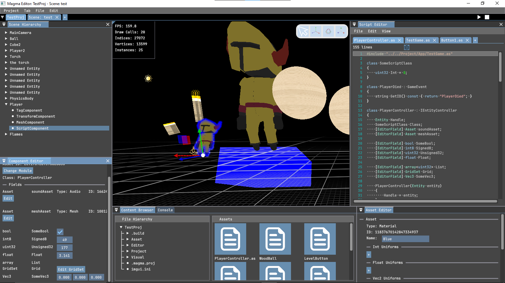
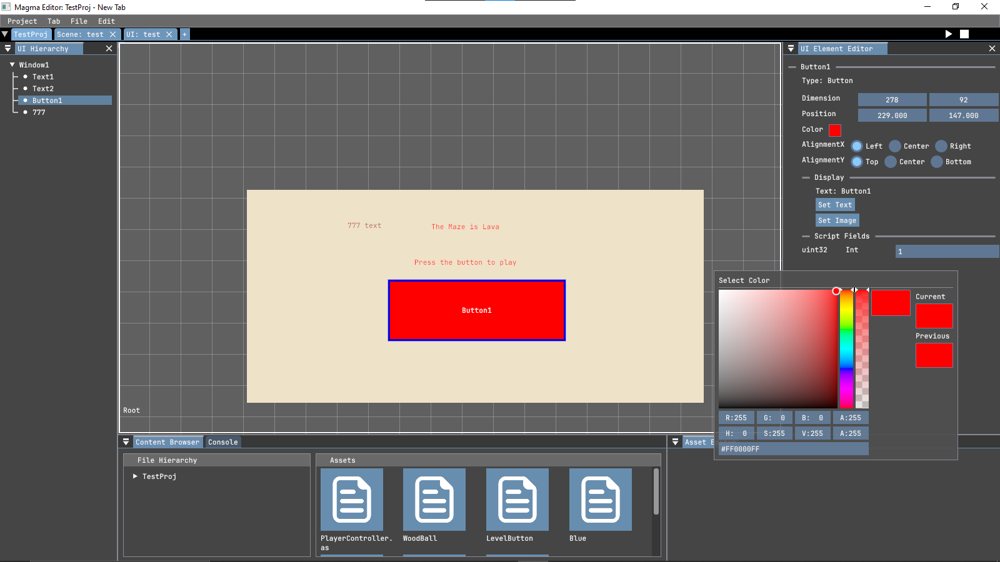
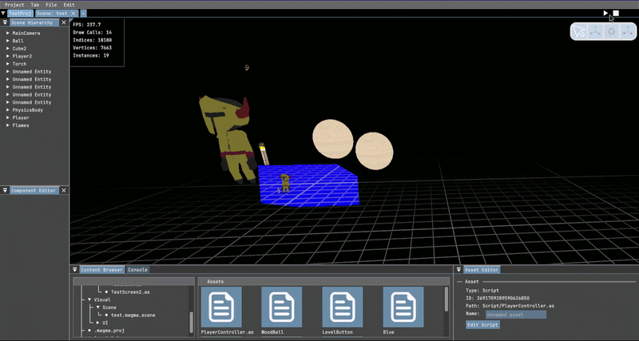
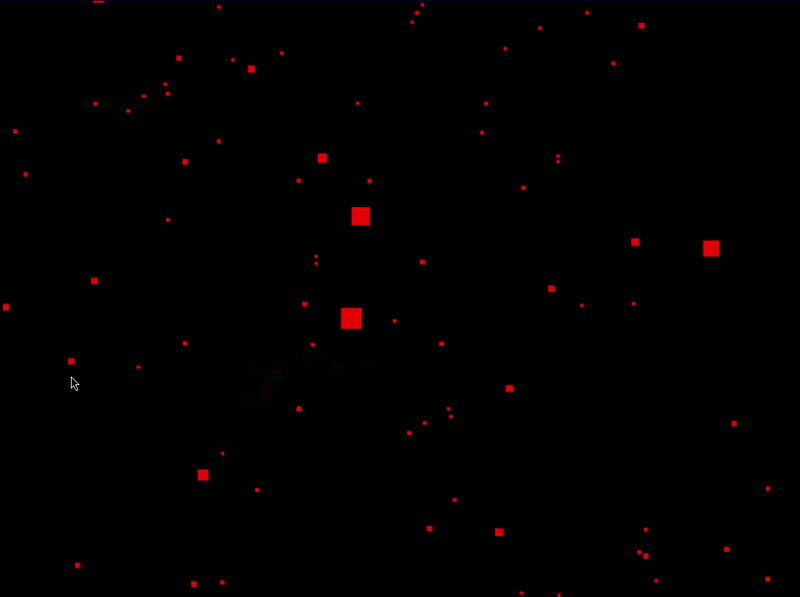
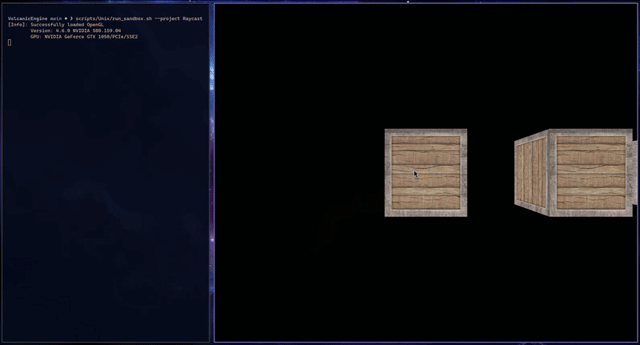

### NOTE: A new-and-improved version of the project continues to be developed [here](https://github.com/Jernesstar/Volcanic-Engine)
---

# VolcanicEngine
**VolcanicEngine** is a high-performance, modular 3D game engine developed in Modern C++.  
It features a Vulkan-inspired graphics abstraction layer, a pure ECS architecture, and an IDE with real-time debugging capabilities.  
Inspired by **TheCherno's** *Game Engine* series  
16K+ LOC, **100%** AI-free.

## 📂 Project Structure

*   `VolcaniCore/`: Low-level platform & graphics abstraction.
*   `Magma/`: Core engine library and the Integrated Editor.
*   `Lava/`: Standalone runtime and scripting bridge.
*   `Sandbox/`: Technical demos and example projects.

## 🛠 Core Architecture Deep-Dive

### 1. VolcaniCore: The Foundational Layer
VolcaniCore provides the platform-agnostic abstractions and low-level graphics primitives that power the entire ecosystem.
*   **Platform Abstraction**: Seamless windowing and input handling via GLFW, with a robust event-driven architecture.
*   **Graphics API Abstraction**: A "Vulkan-style" abstraction over OpenGL. It introduces `RenderPass`, `Framebuffer` and other such objects, enabling explicit control over the rendering pipeline.
*   **Resource Management**: Low-level wrappers for `Shader`, `Texture`, `UniformBuffer`, and `StorageBuffer` (SSBO) to ensure type safety and efficient GPU memory management.

### 2. Magma Engine: System Integration
The heart of the engine, Magma integrates high-level systems into a cohesive framework.
*   **ECS (Powered by Flecs)**: A pure, high-performance Entity Component System. It leverages `flecs` for efficient cache-friendly data layouts and complex system queries.
*   **Physics (NVIDIA PhysX)**: Integration of the industry-standard PhysX engine. Supports rigid body dynamics, complex collision shapes (Box, Sphere, Capsule, Mesh), and high-precision raycasting.
*   **Scripting (AngelScript)**: A deeply integrated C++-like scripting language. Magma features a custom reflection system and metadata support, allowing for seamless communication between C++ systems and script logic.
*   **Asset Pipeline**: A custom-built UUID-based management system. Assets (Meshes, Textures, Shaders, Scripts) are tracked via unique identifiers, supporting hot-reloading and automatic dependency tracking.

### 3. Magma Editor: The Integrated Development IDE
A comprehensive toolset built with ImGui, designed to streamline the development workflow.
*   **Visual Scene Editing**: Intuitive hierarchy and inspector panels for real-time entity manipulation. Includes gizmos for transform manipulation and visual debuggers for physics and cameras.
*   **Integrated Script IDE**: A built-in code editor with syntax highlighting, linting, and a **Line-by-Line Debugger**. Developers can set breakpoints, step through code, and inspect script variables in real-time.
*   **Serialization**: Supports dual-mode serialization. **YAML/JSON** is used for project files and scenes to ensure version-control friendliness, while a custom **Binary Serialization** format is used for optimized distribution.
*   **Asset Importer**: A robust pipeline that processes raw formats (FBX, PNG, GLSL) into engine-optimized assets.

### Editor UI
|  |  |
| :--- | :--- |
| **SceneTab** |    Scene Visualizer, Component Editor, Script Editor, Scene Hierarchy, Asset browser, and Asset Editor panels |
| **UITab** |    Element hierarchy, Element editor, Canvas Viewer panels |
| **Scene Testing** |    Running scene in debug mode allows for setting breakpoints and inspecting values |

---

### 4. Lava Runtime: Optimized Execution
Lava is the lightweight, standalone runtime designed for end-user distribution.
*   **Lava Scene Renderer**: A streamlined, high-performance version of the renderer tailored for final output, stripped of editor-specific overhead.
*   **Serialized Loading**: Optimized for speed, the runtime loads pre-compiled binary assets and scenes, minimizing boot times and memory footprint.
*   **Script Glue**: A dedicated binding layer that exposes engine internals to AngelScript, ensuring minimal overhead for gameplay logic.

## 🚀 Demos & Technical Showcases
Found in Sandbox/Demos
| Demo | Technical Highlight |
| :--- | :--- |
| **Bloom** |    PBR-correct multi-pass bloom filter using a downsampling/upsampling mip-chain to achieve high-quality light bleeding. |
| **Particles** |    A compute-shader driven particle system.   Utilizes `StorageBuffers` for massive parallel updates and rendering of 1M+ particles. |
| **Raycast** |    An interactive sandbox demonstrating high-precision raycasting using PhysX rigid body bodies for object selection.   Object outlining via mask rendering and edge detection. |
| **Cube** |    Showcase of using the isometric camera and a low-resolution frame buffer to create a pixel art effect   Object instancing enables 60+ FPS for 20,000 instances. |
| **Shadows** |    Shadow casting using a shadowmap |

---

## 📄 License
This project is licensed under the MIT License - see the [LICENSE](LICENSE) file for details.
